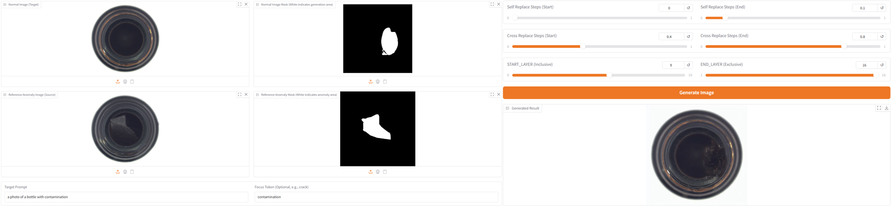
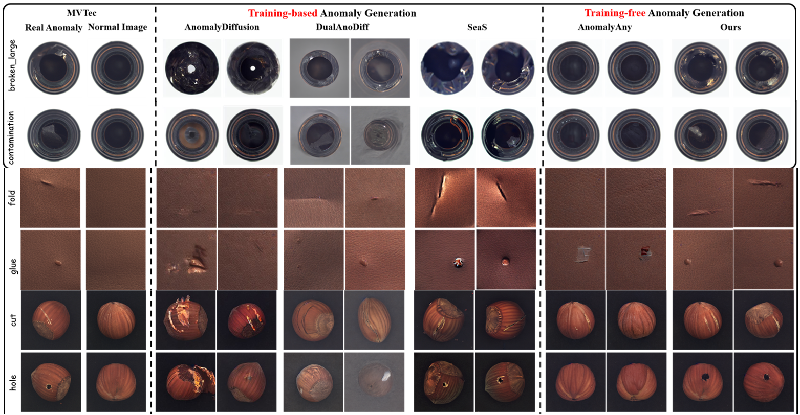
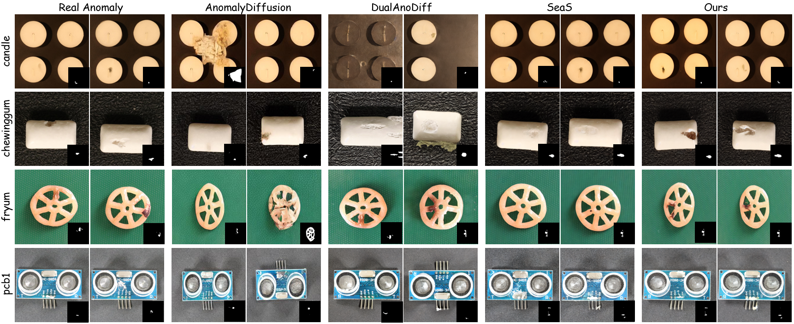
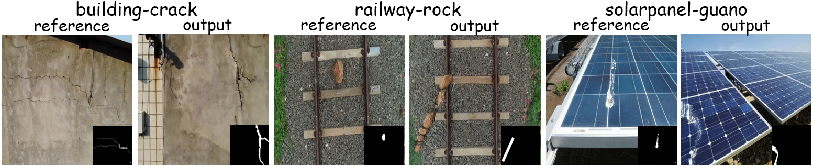

# One-to-More: High-Fidelity Training-Free Anomaly Generation with Attention Control


## Installation

1. Create and activate a new Conda environment:

```shell
conda env create -f environment.yml
conda activate O2MAG
```

## Mask Generation

We use AnomalyDiffusion masks for MVTec-AD and SeaS for VisA/Real-IAD.

We have released the generated image-mask pairs for MVTec-AD.

Generated 500 image-mask pairs: [Google Drive Link](https://drive.google.com/drive/folders/1clU5fkX5juxuKwDHhsIzRJ_hpKkVxFNT?usp=sharing)

## Normal Data Augmentation

See Appendix C.1. for detailed information. We encourage you to explore other augmentation strategies to achieve better performance.

```
python ./img_augment.py
```

## Anomaly Generation

We provide three ways to run and evaluate our anomaly generation code:

1. **Interactive Web UI** (Requires approx. 14GB VRAM)

   Quickly edit and visualize anomalies in your browser.

```shell
python ./app_edit_anomaly_mask.py
```



------

2. **Jupyter Notebook** (Requires approx. 16GB VRAM)

```
edit_anomaly_mask.ipynb
```

------

3. Generate 1000 anomaly images per anomaly type.  About 24G.

```
python edit_anomaly_moregpu_oneshot.py --root ./datasets/mvtec \
    --normal_path ./data_agument
    --sourece_image_mask ./anomalydiffusion/generated_mask \
    --embedding_file ./embed_bank/mvtec \
    --outputs_path ./generated_data_fewshot/mvtec \
    --pairs-file ./anomaly_name/name-mvtec.txt --devices cuda:2,cuda:3,cuda:4,cuda:5
```

- `--root`: Path to the MVTec-AD dataset.
- `--normal_path`: Path to the augmented normal data.
- `--sourece_image_mask`: Directory containing the generated anomaly masks.
- `--pairs-file` : Specifies the object category and anomaly type to generate (e.g., `'cable+combined'`).
- `--devices` : Specifies the GPUs to be used. For single-GPU execution, use `--devices cuda:0,` (note the trailing comma).

## Attention Map Visualization

To visualize the attention maps, please follow these steps:

1. **Enable Attention Storage:** In `triag/mca_p2p.py`, change `AttentionBase` to `AttentionStore`.    *(Note: This process requires approx. 32GB of VRAM).*
2. **Run the Visualization Script:** Execute the `visualization_attention_map.py` script. It is ready to run out-of-the-box, but please ensure you update the following variables inside the script to match your local environment:   `model_path` and paths for the corresponding reference anomaly and normal images.

## Evaluation

### Compute KID

```
python eval/compute-kid.py --generated_path $path_to_the_generated_data  --real_path=$path_to_mvtec
```

### Anomaly detection

Train U-Net

```
python train-localization.py \
  --mvtec_path=$path_to_mvtec \
  --generated_data_path=$path_to_the_generated_data \
  --save_path=$path_to_save_checkpoint
```

Test

```
python test-localization.py \
  --mvtec_path=$path_to_mvtec \
  --checkpoint_path=$path_to_save_checkpoint
```

### Anomaly classification

Train ResNet-34

```
python train-classification.py --mvtec_path $path_to_mvtec \
 --generated_data_path $path_to_the_generated_data \
 --checkpoint_path $path_to_save_checkpoint
```

Test

```
python test-classification.py --mvtec_path $path_to_mvtec \
 --generated_data_path $path_to_the_generated_data \
 --checkpoint_path $path_to_save_checkpoint
```

## Results of anomaly image generation

The generation results of anomaly images and normal images are shown as follows:







## Citation

If you find our work useful in your research, please consider citing our paper.
